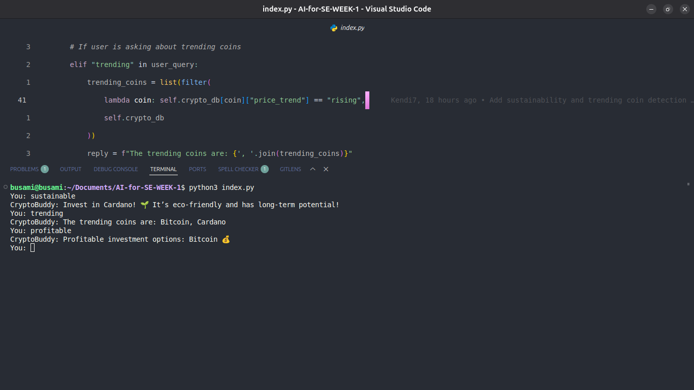

# CryptoChatbot Screenshot

# `CryptoChatbot` Class

This Python class powers our crypto-focused chatbot, **CryptoBuddy**. It provides intelligent responses to user questions about cryptocurrency trends, profitability, and sustainability. Here's a quick breakdown:

- **Name:** `CryptoBuddy`
- **Personality:** Friendly, smart, and eco-conscious 💚
- **Data:** Built-in knowledge of coins like Bitcoin, Ethereum, and Cardano.
- **Core Features:**
  - Recommends the most sustainable coin
  - Lists trending cryptocurrencies
  - Suggests profitable investment options
  - Tracks chat history for each session
- **Usage:** An instance is created and run in a simple loop to interact via terminal input/output.

This is part of our continuing work to make the platform more interactive and informative. Feel free to explore or expand its functionality!

## Final Thoughts

Thanks for taking the time to read this! Following this workflow will help us:

- Avoid conflicts and broken code
- Keep our project history clean
- Make code reviews easier
- Work together more effectively

Remember: when in doubt, ask! I'd rather answer questions than fix broken main branches. Let's build something awesome together! 🚀

---

_Last updated: [Date] - If you have suggestions for improving this guide, let me know!_
